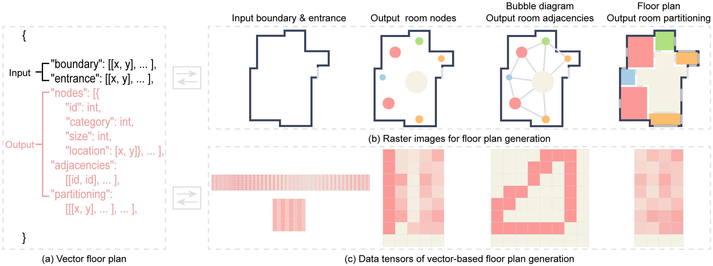

## [Eliminating Rasterization: Direct Vector Floor Plan Generation with DiffPlanner](https://ieeexplore.ieee.org/document/10960645)

[Shidong Wang](https://shidong-wang.github.io) and [Renato Pajarola](https://www.ifi.uzh.ch/en/vmml/people/current-staff/pajarola.html)

IEEE Transactions on Visualization and Computer Graphics, xx(x): 1-17, 2025. (**TVCG**)




## Getting Started

### Configuration
* Python 3.9.18
* Pytorch 2.0.0
* NumPy 1.21.5

### Dataset

* (Optional) Download the preprocessed RPLAN dataset from [here](https://github.com/HanHan55/Graph2plan/releases/download/data/Data.zip) and place it in the folder `\dataset\dataset_mat`. Then, run `python data_preparation.py` to generate the final dataset in the folder `\dataset\dataset_json`.
* The dataset used in this paper can also be downloaded from [here](https://github.com/shidong-wang/DiffPlanner/releases/download/dataset/dataset.zip). After downloading, place the dataset in the folder `\dataset\dataset_json`.

### Training

* We provide separate training scripts (`scripts\train.py`) for the three sub-models (NodeDiff, AdjacencyDiff, \& PartitioningDiff). You can adjust the parameters to determine which conditions each model supports. For example:
```
    cd node_diff/scripts
    python train.py --dataset rplan --batch_size 1024 --set_name train --support_boundary True  --support_conditions '' --support_partial False
    cd adjacency_diff/scripts
    python train.py --dataset rplan --batch_size 1024 --set_name train --support_boundary True  --support_conditions 'ncsl' --support_partial False
    cd partitioning_diff/scripts
    python train.py --dataset rplan --batch_size 1024 --set_name train --support_boundary True  --support_conditions 'ncsla' --support_partial False
```

* The trained model can be download [here](https://github.com/shidong-wang/DiffPlanner/releases/download/trained_model/trained_model.zip) for testing.

### Testing

* Move the trained models into the folder `scripts/trained_model`.
* Run the sampling scripts (`scripts\sample.py`) for the three sub-models in sequence, and optionally adjust the parameters to specify the input conditions. For example:

Generating bubble diagrams and floor plans using only the input boundary with entrance, without requiring any additional conditions:
```
    cd node_diff/scripts
    python sample.py --dataset rplan --batch_size 1024 --set_name test --model_path trained_model/b_model300000.pt --num_samples 12002 --support_boundary True --support_conditions '' --support_partial False

    cd adjacency_diff/scripts
    python sample.py --dataset rplan --batch_size 1024 --set_name test --model_path trained_model/bncsl_model300000.pt --num_samples 12002 --support_boundary True --support_conditions 'ncsl' --support_partial False --syn_dataset_path ../../output/output_json/b.json

    cd partitioning_diff/scripts
    python sample.py --dataset rplan --batch_size 1024 --set_name test --model_path trained_model/bncsla_model300000.pt --num_samples 12002 --support_boundary True --support_conditions 'ncsla' --support_partial False --syn_dataset_path ../../output/output_json/b.json
```

* Navigate to `/output`, and run `python post_processing.py` to get the aligned floor plans.
* Run `python visualization.py`, and then you can obtain the rasterized color bubble diagrams & floor plans in folder `output/output_vis`.

### Acknowledgement
* Original RPLAN dataset: http://staff.ustc.edu.cn/~fuxm/projects/DeepLayout/index.html
* Preprocessed RPLAN dataset: https://github.com/HanHan55/Graph2plan

### Citation (Bibtex)
Please cite our paper if you find it useful:

``` 
@ARTICLE{wang2025diffplanner,
  author = {Wang, Shidong and Pajarola, Renato},
  journal = {IEEE Transactions on Visualization and Computer Graphics}, 
  title = {Eliminating Rasterization: Direct Vector Floor Plan Generation with DiffPlanner}, 
  year = {2025},
  volume = {},
  number = {},
  pages = {1-17},
  doi = {10.1109/TVCG.2025.3559682}
  }
```